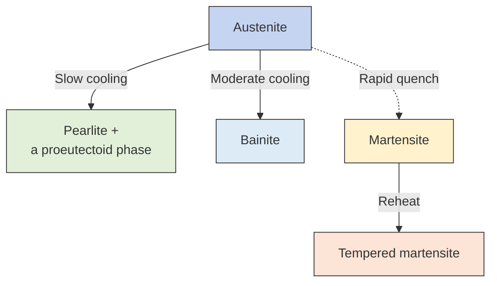

# Constants

Avogadro Constant: $N_A = 6.022\times 10^{23} \space\rm{mol}^{-1}$
Boltzmann Constant: $k_B = 1.381\times 10^{-23}\space\rm{J/K} = 8.617\times 10^{-5} \space\rm{eV/k}$
Gas Constant: $8.314 \space\mathrm{J/(kg\cdot mol)}$

# Mechanical Properties

## Stress & Strain

1. Tension & Compression
$$
\sigma = \frac{F}{A_0},\space \epsilon = \frac{\Delta l}{l_0}
$$

2. Shear & Torsion
$$
\tau = \frac{F}{A_0}, \space \gamma = \tan\theta \space\rm{(shear)}, \space \varphi \rm{(torsion)}
$$

## Key Mechanical Properties

1. Young's modulus: $E = \dfrac{\sigma}{\epsilon}$
2. Yield strength: $\sigma_Y = \rm{0.2\% offset}$ or $\sigma_Y = \dfrac{\sigma_{up}+\sigma_{lp}}{2}$
3. Tensile strength (Ultimate Tensile Strength, UTS): $\sigma_{UTS} = \max \sigma$
4. Ductility: percent of elongation at failure $100 \cdot \epsilon_f$ or percent reduction in area $\dfrac{A_0-A_{final}}{A_0}$
5. Toughness: $\int_0^{\epsilon_f} \sigma \rm{d}\epsilon$
6. Hardness: Brinell, Vickers, Knoop microhardness & Rockwell

## Elastic Deformation

Elastic, Viscous & Viscoelastic

Hooke's Law: $\sigma = E\epsilon$, $\tau = G\gamma$

$E_{ceremics} \gtrsim E_{metals} \gg E_{polymers}$

Poisson's ration: $\nu = -\dfrac{\epsilon_x}{\epsilon_z}$

For isotropic materials: $G = \dfrac{E}{2(1+\nu)}$

## Plastic Deformation

Safe stress: $\sigma_W = \dfrac{\sigma_Y}{N}$, where $N$ is the safety factor

Brittle & Ductile Materials

Ductility is a function of temperature, the strain rate and the stress state.

Approximately, high $T\space \Rightarrow$ ductile, low $T \Rightarrow$ brittle

Hardness Test

![[hardness test.png |center |720]]

Both tensile strength and hardness are indicators of a metal's resistance to plastic deformation. Consequently, they are roughly proportional.

# Fracture & Failure

## Simple Fractures: resulting from uniaxial tensile loads

Low temperature & slowly changing/uniaxial tensile stress

### Fracture modes

**Ductile**

obvious plastic deformation, energy absorption
cup-cone shape fracture section, $45^\circ$
preferred in  applications

**Brittle**

$\epsilon_f < 5\%$
fast crack propagation
perpendicular to the fracture surface
transgranular fracture & intergranular fracture 穿晶断裂 & 延晶断裂

### Stress Concentration

**Stress Concentration Factor**

Applied stress may be amplified at the tips.
$$
\sigma_m=2\sigma_0\sqrt{\frac{a}{\rho_t}}
$$
$a$: length of a surface crack or half of the length of an internal crack
$\rho_t$: radius of curvature of the crack tip
$K_t$: stress concentration factor
$$
K_t=\frac{\sigma_m}{\sigma_0}=2\sqrt{\frac{a}{\rho_t}}
$$

**Critical Stress & Max Flaw Length**

$\sigma_c$: critical stress required for crack propagation in a brittle material
$$
\sigma_c=\sqrt{\frac{2E\gamma_s}{\pi a}}
$$
$\gamma_s$: specific surface energy
$$
a_c=\sqrt{\frac{2E\gamma_s}{\pi \sigma^2}}
$$

**Fracture Toughness**

$K_c$: fracture toughness, $\mathrm{MPa\sqrt{m}}$ 
$$
K_c=K\sigma_c\sqrt{\pi a}
$$
$Y$: dimensionless factor

**Ductile to Brittle Transition**

DBTT: ductile to brittle transition temperature
$$
T\downarrow \quad \Longrightarrow \quad \mathrm{britleness} \uparrow
$$

## Fatigue: failure under fluctuating/cyclic stresses

Mean stress: $\sigma_m = (\sigma_{max}+\sigma_{min})/2$
Range of stress: $\sigma_r = \sigma_{max}-\sigma_{min}$
Stress amplitude: $\sigma_a = \sigma_r/2$
Stress ratio: $R = \sigma_{min}/\sigma_{max}$

**Measurement**: rotating-bending fatigue test

**S-N Curves**: stress amplitude $S$ vs. cycle of failure $N$

**Fatigue Limit**: the maximum stress amplitude below which the material never fails

fatigue strength $S(N)$ - fatigue life $N(S)$

$$
N_f = N_i+N_p
$$
$N_f$: number of cycles to failure
$N_i$: number of cycles for crack initiation
$N_p$: number of cycles for crack propagation

## Creep: failure under constant load at elevated temperatures

Conditions: $T > 0.4T_m$

1. Instantaneous deformation
2. Primary/transient creep
3. Secondary/steady-state creep
$$
\epsilon_s = \frac{\Delta\epsilon}{\Delta t}
$$
4. Tertiary

**Power-law Creep Equation** (empirical relation, improved Arrhenius equation)
$$
\dot{\epsilon}_s = K_2 \sigma^n \exp\left(-\frac{Q_c}{RT}\right)
$$
# Phase Diagrams

solvent 溶剂 solute 溶质 isomorphous 同晶的 eutectic 共晶

**Phase**: a homogeneous portion of a system that has uniform physical and chemical characteristics (solid iron vs. liquid iron, ferrite vs. cementite)

**Microstructure**: grain size and shape - subject to direct microscopic observation using optical or electron microscopes (pearlite vs. austenite)

**Crucial Temperatures**

1. $912\space\mathrm{C^\circ}:\space \alpha-Fe(bcc) \longleftrightarrow \gamma-Fe(fcc)$
2. $1394\space\mathrm{C^\circ}:\space \gamma-Fe(fcc) \longleftrightarrow \delta-Fe(bcc)$
3. $1538\space\mathrm{C^\circ}:\space \delta-Fe(fcc) \longleftrightarrow L$

### Binary Phase Diagram

**Binary Isomorphous Systems**

![[binary isomorphous phase diagram.png|center|540]]

**Lever Law**

![[lever law.png|center]]
$$
Q_l+Q_\alpha = 1,\space Q_L x_1+Q_\alpha x_2 = x
$$
$$
Q_L = \frac{x_2-x}{x_2-x_1}, \space Q\alpha = \frac{x-x_1}{x_2-x_1} 
$$

**Binary Eutectic Systems**

Considering a system contains metal A and B.

$\alpha$ phase: B dissolves in A, i.e. A-rich solid solution
$\beta$ phase: A dissolves in B, i.e. B-rich solid solution

In extreme cases, A and B are completely immiscible, such as Bi and Cd alloy system, where there is no $\alpha$ and $\beta$ on the left and right side.

* **Eutectic transformation (constant $T$)**:
$$
L(C_E) \underset{\text { heating }}{\stackrel{\text { coling }}{\longrightleftharpoons}} \alpha(C_{\alpha E})+\beta(C_{\beta E})
$$
	e.g. Ag and Cu eutectic system
$$
L(71.9 \mathrm{wt} \% \mathrm{Ag}) \underset{\text { heating }}{\stackrel{\text { coling }}{\longrightleftharpoons}} \alpha(8.0 \mathrm{wt} \% \mathrm{Ag})+\beta(91.2 \mathrm{wt} \% \mathrm{Ag})
$$

![[binary phase diagram of Ag and Cu.png|center|630]]

# Iron-Iron Carbide Phase Diagram

## Basic Concepts

### Phases

Note that solids (except $Fe_3C$) are all solid solutions.

1. **Ferrite ($\alpha$-Fe)**
	Carbon atoms dissolve in $\alpha$-Fe, BCC structure, extremely low solubility (0.022% in room temperature).

2. **Austenite ($\gamma$-Fe)**
	Carbon atoms dissolve in $\gamma$-Fe, FCC structure, relatively high solubility (max 2.11%), exists above $727\space\mathrm{C^\circ}$

3. **Cementite ($Fe_3C$)**
	Compounds composed of iron and carbon, wt%C = 6.69%

4. **$\delta$-Ferrite ($\delta$-Fe)**
	Ferrite under high temperature, BCC structure, exists above $1394\mathrm{C^\circ}$

5. **Liquid (L)**

### Microstructures

#### Equilibrium Microstructures

1. **Pearlite (P)**
2. **Ledeburite (Ld)**
3. **Transformed Ledeburite (Ld')**
4. **Pro-eutectoid Phases**

#### Non-equilibrium Microstructures

1. **Martensite (M)**
2. **Bainite (B)**
3. **Tempered Structures**

## $Fe$-$C$ Phase Diagram

![[Fe-C diagram 1.png|center|480]]
### Illustration of the Diagram

#### Melting Points

**A**(0, **1538)**: melting point of iron

**D**(6.7, 1227): melting point of $Fe_3C$ (calculated)

#### Phase Transformation Points of Pure Iron

**N**(0, **1394**): $\delta-Fe \Longleftrightarrow \gamma-Fe$

**G**(0, **912**): $\gamma-Fe \Longleftrightarrow \alpha-Fe$

#### Solubility Limit Points

**H**(**0.09**, 1495): solubility limit of $\delta-Fe$

**E**(**2.14**, 1148): solubility limit of $\gamma-Fe$, also the boundary between the steel and cast iron

**P**(**0.0218**, 727): solubility limit of $\alpha-Fe$

**Q**(**0.0008**, room temperature): solubility of $\alpha-Fe$ in room temperature

#### 3 Phases Coexist Points

**J**(**0.17**. 1495):  peritectic point, $L+\delta+\gamma$

**C**(**4.3**, 1148): eutectic point, $L+\gamma+Fe_3C$

**S**(**0.76**, 727): eutectoid point, $\alpha+\gamma+Fe_3C$

| Point | 名称  |    Name    |              Equation               |           Status            |
| :---: | :-: | :--------: | :---------------------------------: | :-------------------------: |
|   C   | 共晶点 |  Eutectic  |   $L \rightarrow \gamma + Fe_3C$    |  $L \rightarrow S_1 + S_2$  |
|   S   | 共析点 | Eutectoid  | $\gamma \rightarrow \alpha + Fe_3C$ | $S_1 \rightarrow S_2 + S_3$ |
|   J   | 包晶点 | Peritectic |   $L + \delta \rightarrow \gamma$   |  $L + S_1 \rightarrow S_2$  |

#### Liquidus & Solidus Lines

![[Pasted image 20260106233028.png|center|420]]

**ABCD**: liquidus line

**AHJECF**: solidus line

#### Isothermal Transformation Lines

![[Pasted image 20260106233952.png|center|420]]

**HJB**: peritectic reaction, $L\rightarrow \delta+\gamma$

**ECF**: eutectic reaction, $L\rightarrow\gamma+Fe_3C$

**PSK**: eutectoid reaction, $\gamma\rightarrow \alpha+Fe_3C$

#### Allotropic Transformation Lines

同素异形转变(isomeric, 同分异构)

![[allostropic transformation (austenite and ferrite).png|120]]

![[allostropic transformation (delta and austenite).png|120]]

* $\delta-Fe$ to $\gamma-Fe$
	**HN**: start; **JN**: end

* $\gamma-Fe$ to $\alpha-Fe$
	**GS**: start; **GP**: end

#### Relationship between Single and Double Phase Areas

* A double phase area is sandwiched between two single phases

* The two phases of the double phase areas are composed of the double phase of the adjacent single-phase areas

### Typical Transformations

#### Isomorphous Transformation

匀晶转变

When an alloy is cooled from a liquid state, it directly transformed into a single solid solution.

Conditions: completely miscible (four rules of **Hume-Rothery**)

#### Allotropic Transformation

Transformation between different **single** ferrous solid solutions.

**High Temperature Region**

$\delta \rightarrow \delta+\gamma \rightarrow \gamma$

**Moderate-Low Temperature Region**

$\gamma \rightarrow \alpha+\gamma \rightarrow \alpha$

#### Precipitation Transformation

析出转变

The solubility decreases with the decreasing of  the temperature, where a solute precipitates. Here it refers to cementite precipitating from the Austenite (according to the solvus line).

![[Fe-C_precipitation.png|center|420]]

|     Parent Face      | Solvus Line | Precipitated Product |         Name          |
| :------------------: | :---------: | :------------------: | :-------------------: |
| Austenite ($\gamma$) |     ES      |      Cementite       | 二次渗碳体 ($Fe_3C_{II}$)  |
|  Ferrite ($\alpha$)  |     PQ      |      Cementite       | 三次渗碳体 ($Fe_3C_{III}$) |
|   $\delta$-Ferrite   |     NH      |      Austenite       |                       |

* **Primary Cementite** ($Fe_3 C_{I}$): directly crystalized from the liquid phase (below CD)
* **Secondary Cementite** ($Fe_3C_{II}$): precipitated from the Austenite phase (below ES)
* **Tertiary Cementite** ($Fe_3C_{III}$): precipitated from the Ferrite phase (below PQ)

#### Isothermal/Invariant Transformation

![[Pasted image 20260107132538.png|center|420]]

##### Peritectic Reaction (包晶反应)

HJB, 1495 ℃. The liquid phase encounters the previously crystallized $\delta$-ferrite, and then the new austenite phase is formed.

**Equation at J(0.17, 1495)**: $L(0.35\%)+\delta(0.09\%)\rightarrow \gamma(0.17\%)$

##### Eutectic Reaction (共晶反应)

ECF, 1148℃. The liquid phase crystallizes into two solid phases simultaneously: Austenite and cementite (Ledeburite, 莱氏体). The core reaction of the solidification of cast iron.

**Equation at C(4.3, 1148)**: $L(4.3\%)\rightarrow \gamma(2.11\%)+Fe_3C$

##### Eutectoid Reaction (共析反应)

PSK, 727℃. The austenite decomposes into two solid phases: ferrite and cementite (Pearlite, 珠光体). Important reaction of the heat processing of steel.

**Equation at S(0.76, 727)**: $\gamma(0.76\%) \rightarrow \alpha(0.0218\%)+Fe_3C$

## Development of Microstructures

### Cooling Process Analysis for Hypoeutectoid Steel (0.40% C)
![[cooling line of hypoeutectoid steel.png|center|240]]

#### 1. Initial Solidification (Point 1)

*   **Point 1 (Liquidus Line):** As the temperature drops to the liquidus line, the liquid phase (**L**) begins to solidify into **$\delta$-ferrite** through an isomorphous-type transformation ($L \to \delta$).
*   **Between Points 1 and 2:** The alloy is in a two-phase region ($L + \delta$). The amount of liquid decreases while the amount of $\delta$-ferrite increases.

#### 2. The Peritectic Reaction (Point 2)

*   **Point 2 (1495°C):** This is the **Peritectic horizontal line**. An invariant reaction occurs:
$$\delta (0.09\% C) + L (0.53\% C) \xrightarrow{1495°C} \gamma (0.17\% C)$$
*   **Analysis:** Since the alloy's composition (0.40% C) is greater than the peritectic point (0.17% C), the $\delta$-ferrite is completely consumed, leaving behind **surplus liquid** and the newly formed **austenite ($\gamma$)**.

#### 3. Completion of Solidification (Between Points 2 and 3)

*   **Region 2–3:** The remaining liquid continues to transform into austenite ($\gamma$).
*   **Point 3 (Solidus Line):** Solidification is complete. The alloy now consists entirely of a single phase: **Austenite ($\gamma$)** with 0.40% C.
*   **Region 3–4:** The alloy cools through the single-phase austenite field without any further phase change.

#### 4. Pro-eutectoid Ferrite Formation (Point 4)

*   **Point 4:** As the temperature hits the GS line, austenite begins to transform into **$\alpha$-ferrite** ($\gamma \to \alpha$). 
*   **Region 4–5:** This is a two-phase region ($\gamma + \alpha$). The ferrite that forms here is called **pro-eutectoid ferrite** (先共析铁素体) because it forms before the eutectoid reaction. As cooling continues, the carbon content of the remaining austenite increases along the GS line toward the S-point (0.77% C).

#### 5. The Eutectoid Transformation (Point 5)

*   **Point 5 (727°C):** The temperature reaches the **Eutectoid horizontal line**. The remaining austenite, now containing exactly 0.77% C, undergoes an invariant reaction:
$$\gamma (0.77\% C) \xrightarrow{727°C} \alpha (0.0218\% C) + Fe_3C$$
*   **Microstructure:** The product of this reaction is **Pearlite (P)**, a lamellar mixture of ferrite and cementite.
*   **Final Result:** At this point, the microstructure consists of **Pro-eutectoid Ferrite (F)** + **Pearlite (P)**.

![[pearlite structure.png|center|240]]

#### 6. Room Temperature (After Point 5)

*   **Beyond Point 5:** As the temperature continues to fall toward room temperature, the solubility of carbon in ferrite decreases (along the PQ line). A negligible amount of **tertiary cementite ($Fe_3C_{III}$)** precipitates from the ferrite.

|  Temperature Stage   |       Phases Present        |                Transformation Type                 |
| :------------------: | :-------------------------: | :------------------------------------------------: |
|     **Point 1**      |       $L \to \delta$        |              Start of Solidification               |
| **Point 2 (1495°C)** |   $L + \delta \to \gamma$   |   **Peritectic Reaction** (Surplus $L$ remains)    |
|     **Point 3**      |       $\gamma$ (100%)       |                Full Solidification                 |
|     **Point 4**      |     $\gamma \to \alpha$     |       Formation of **Pro-eutectoid Ferrite**       |
| **Point 5 (727°C)**  | $\gamma \to \alpha + Fe_3C$ | **Eutectoid Reaction** (Formation of **Pearlite**) |
|   **Final State**    |   **Ferrite + Pearlite**    |             Equilibrium Microstructure             |

### Cooling Process Analysis of Eutectoid Steel (0.76%)

![[eutectoid cooling line.png|center|240]]

#### 1. Solidification Stage (Point 1 to 2)

*   **Above Point 1:** The alloy is entirely in the **liquid phase (L)**.
*   **At Point 1 (Liquidus):** Solidification begins with the formation of **Austenite ($\gamma$)** crystals from the melt ($L \to \gamma$).
*   **Between 1 & 2:** The alloy exists as a mixture of liquid and austenite ($L + \gamma$).
*   **At Point 2 (Solidus):** Solidification is complete. The alloy is now 100% **Austenite ($\gamma$)**.

#### 2. Single-Phase Cooling (Point 2 to 3)

*   The alloy cools through the austenite stable field. Because the carbon content is exactly at the eutectoid composition (0.76%), **no pro-eutectoid phases** (like ferrite or cementite) are precipitated during this interval.

![[development of pearlite.png|center|300]]

#### 3. The Eutectoid Reaction (Point 3)

*   **At Point 3 (S-point, 727°C):** The temperature reaches the eutectoid isotherm. The austenite undergoes an **invariant reaction**:
$$\gamma (0.76\% C) \xrightarrow{727°C} \alpha (0.022\% C) + Fe_3C (6.70\% C)$$
*   The product is **Pearlite (P)**, which is a microconstituent composed of alternating lamellae (layers) of **ferrite ($\alpha$)** and **cementite ($Fe_3C$)**.

#### 4. Final Microstructure at Room Temperature

*   Below 727°C, there is a minute precipitation of **tertiary cementite ($Fe_3C_{III}$)** from the ferrite due to decreasing solubility (along the PQ line), which is typically negligible.
*   **Final Microstructure:** 100% **Pearlite (P)**.
*   **Final Phases:** **Ferrite ($\alpha$)** and **Cementite ($Fe_3C$)**.

### Cooling Process Analysis of Hypereutectoid Steel (1.2% C)

![[cooling line of hypereutectoid steel.png|center|250]]

#### 1. Solidification Stage (Point 1 to 2)

*   **Above Point 1:** The alloy is a homogeneous **liquid (L)**.
*   **At Point 1 (Liquidus):** Solidification begins. Austenite ($\gamma$) starts to form from the melt.
*   **At Point 2 (Solidus):** Solidification is complete. The alloy becomes 100% **Austenite ($\gamma$)** with a composition of 1.2% C.

#### 2. Cooling in Austenite Phase (Point 2 to 3)

*   The alloy cools through the single-phase austenite region. No phase change occurs until the temperature hits the solubility limit.

#### 3. Precipitation of Secondary Cementite (Point 3 to 4)

*   **At Point 3 ($A_{cm}$ line):** The alloy reaches the maximum solubility of carbon in austenite. As the temperature drops further, the "excess" carbon is expelled from the solid solution to form **Secondary Cementite ($Fe_3C_{II}$)**.
*   **Between 3 & 4:** The amount of $Fe_3C_{II}$ increases. These precipitates usually form a **network** along the austenite grain boundaries. Meanwhile, the carbon content of the remaining austenite decreases along the ES line toward 0.77%.

#### 4. The Eutectoid Transformation (Point 4)

*   **At Point 4 (727°C):** The remaining austenite (now at 0.77% C) undergoes the **eutectoid reaction**, transforming into **Pearlite (P)**.
*   The $Fe_3C_{II}$ that formed earlier remains unchanged in the final structure.

#### 5. Final Microstructure at Room Temperature

*   **Final Microstructure:** **Pearlite (P) + Secondary/Proeutectoid Cementite ($Fe_3C_{II}$)**
*   **Visual Characteristic:** Under a microscope, you will see grains of Pearlite surrounded by a thin, hard, and brittle white network of secondary cementite.
![[microstructure development of hypereutectoid steel.png|center|360]]
### Final Products of the Three Typical Steels

*   **Hypoeutectoid (0.40% C):** Pro-eutectoid **Ferrite** + Pearlite.
*   **Eutectoid (0.77% C):** 100% **Pearlite**.
*   **Hypereutectoid (1.2% C):** Pearlite + **Proeutectoid Cementite** (Network).

## Calculation of Phase Compositions

This slide demonstrates the **Lever Rule** calculation for a **0.77% C alloy** at room temperature.

### Phase Compositions of Pearlite (0.76% C) in Room Temperature

#### Key Data

*   **Alloy Composition ($C_0$):** 0.76% C (The Fulcrum)
*   **Ferrite ($C_\alpha$):** 0.0008% C (Point A)
*   **Cementite ($C_{Fe_3C}$):** 6.70% C (Point B)

#### Lever Rule Formulas

To find a phase fraction, divide the **opposite segment** by the **total length**:

*   **Mass Fraction of Ferrite ($M_\alpha$):** 
$$M_\alpha = \frac{6.70 - 0.76}{6.70 - 0.0008} \approx 88.7\%$$
*   **Mass Fraction of Cementite ($M_{Fe_3C}$):** 
$$M_{Fe_3C} = \frac{0.76 - 0.0008}{6.70 - 0.0008} \approx 11.3\%$$

### Microstructure Compositions of Hypoeutectic Steel (0.40% C)

#### Key Concept

At room temperature, the amounts of microconstituents are determined by the state of the alloy at **727°C** just before the eutectoid reaction:

*   The **Austenite ($\gamma$)** present will transform entirely into **Pearlite ($P$)**.
*   The **Ferrite ($\alpha$)** already formed remains as **Pro-eutectoid Ferrite ($F$)**.

#### Data and Calculation

*   **Tie-line endpoints:** 0.022% C (Ferrite) and 0.76% C (Austenite).
*   **Alloy composition ($C_0$):** 0.40% C.

**1. Mass Fraction of Pearlite ($W_P$):**
Using the lever rule (distance from $C_0$ to the ferrite side):
$$W_P = \frac{0.4 - 0.022}{0.76 - 0.022} \times 100\% \approx \mathbf{51.2\%}$$

**2. Mass Fraction of Pro-eutectoid Ferrite ($W_F$):**
$$W_F = 1 - W_P \approx \mathbf{49.8\%}$$

# Isothermal and Non-isothermal Transformation Diagrams

**Classification of phase transformations**

* **Simple Diffusion**: solidification of a pure metal, allotropic transformations and recrystallization
* **Diffusion**: eutectoid reaction
* **Diffusionless**: Transformation: martensite transformation

## Isothermal Transformation Diagrams

### High Temperature, Pearlite

#### Eutectoid Steel

![[isothermal diagram of eutectoid steel (high temp).png|center|360]]

##### Products under Different Temperatures

1. **Coarse Pearlite, P** (粗珠光体)

* **Temperature**: 727℃~650℃
* **Feature**: thick layers, visible under normal microscope
* **Performance**: low hardness (HRC 10-20), good ductility

2. **Sorbite, S** (索氏体, 细珠光体)

* **Temperature**: 650℃~600℃
* **Feature**: thin layers, visible under high magnification microscope
* **Performance**: good comprehensive mechanical properties (strength & toughness)

3. **Troostite, T** (托氏体, 极细珠光体)

* **Temperature**: 600℃~550℃
* **Feature**: extreme thin layers
* **Performance**: highest hardness in pearlites (HRC 35-45)

#### Hypereutectoid Steel

Part of the austenite transforms to proeutectoid cementite before the pearlite transformation begins.

![[isothermal diagram of hypereutectoid steel.png|center|360]]

### Moderate Temperature, Bainite (Eutectoid)

![[isothermal diagram of eutectoid steel (highmid temperatures).png|center|360]]
#### Nature of Transformation

It is a **semi-diffusional** process. While iron atoms undergo a shear-like displacement (similar to Martensite), carbon atoms still have enough thermal energy for short-range diffusion to form fine carbides.

#### Products under Different Temperatures

1. **Upper Bainite**

* **Temperature**: 550℃~350℃
* **Feature**: feather-like, consisting of ferrite laths with cementite precipitates between them
* **Performance**: acceptable strength, but quite brittle, usually avoided

1. **Lower Bainite**

* **Temperature**: 350℃~$M_s$
* **Feature**: acicular (needle-like) plate structure, the carbides are extremely fine and oriented within the ferrite plates.
* **Performance**: high strength, toughness and ductility, extremely favored, accessed from quenching
#### Spheroidization (Spheroidizing, 球化)

Spheroidization is the process of transforming the lamellar (layered) cementite in Pearlite into **spherical (globular)** particles.

- **Driving Force:** The reduction of **interfacial energy**. Lamellar structures have a high surface-area-to-volume ratio; the system naturally seeks a spherical shape to minimize energy and reach a more stable state.
- **The Process:** This is achieved by **Spheroidizing Annealing**, which involves holding the steel at a temperature just below or cycling around the 727°C line for a prolonged period (often several hours).
- **Engineering Purpose:**
    - **Minimum Hardness:** It produces the softest possible state for high-carbon steels.
    - **Maximum Ductility:** It significantly increases the material's ability to deform without breaking.
    - **Improved Machinability:** It is the ideal starting structure for machining hard tool steels or bearing steels, as spherical particles are less abrasive to cutting tools than sharp lamellae.

### Low Temperature, Martensite (Eutectoid)

![[Pasted image 20260107154819.png|center|400]]

#### Mechanism

**Martensitic Transformation** is a **diffusionless, displacive** transformation that occurs when Austenite is rapidly cooled (quenched). Instead of individual atoms moving, the entire lattice undergoes a coordinated **shear** movement. Because carbon atoms do not have time to diffuse out, they remain trapped in the iron lattice.

#### Structure

The crystal structure changes from FCC (Austenite) to **BCT (Body-Centered Tetragonal)**, which is essentially a supersaturated solid solution of carbon in iron.

#### Characteristics

**Athermal**: depends only on the decrease in temperature, not time, very fast

**Products**: depends on carbon content
* **Lath Martensite**: low-carbon steel, high dislocation density, better ductility
* **Plate/Acicular Martensite**: high-carbon steel, extreme distortion, brittle

**Properties**: extremely high **hardness** (stress fields caused by distortion), very brittle

**Access Process**: quenching & tempering

### The Influence of Carbon Content

| Feature             | **Increasing C (up to 0.77%)**                    | **Increasing C (above 0.77%)**                  | **Physical Basis / Reason**                                                                         |
| :------------------ | :------------------------------------------------ | :---------------------------------------------- | :-------------------------------------------------------------------------------------------------- |
| C-Curve Position    | Shifts Rightward (Delayed transformation)         | Shifts Leftward (Accelerated transformation)    | C < 0.77%: Increased diffusion barrier. C > 0.77%: Undissolved carbides act as nucleation sites. |
| $M_s$ & $M_f$ Temps | Shifts Downward (Lowered)                         | Continues to shift Downward                     | Higher C content increases lattice shear resistance and stabilizes Austenite.                       |
| Hardenability       | Increases                                         | Slightly Decreases (usually)                    | Determined by the stability of Austenite and the position of the "nose."                            |
| Retained Austenite  | Increases                                         | Increases Significantly                         | $M_f$ drops below room temperature, making full transformation impossible without sub-zero cooling. |
| Physical Essence    | Solute atoms hinder the redistribution of Carbon. | Nucleation is promoted by pro-eutectoid phases. | Lattice distortion (strain energy) vs. Chemical driving force.                                      |

## Non-isothermal Transformation Diagram

### Continuous-Cooling Transformation Diagrams (CCT)

The C-curve is shifted to the lower right. The start time of the transformation during continuous cooling is later than that of the isothermal transformation, and the temperature is also lower.

Usually, the **Bainite area** is missing, because of the fast transformation.

![[Pasted image 20260107163515.png|center|400]]

#### Critical Cooling Rates

![[Pasted image 20260107164831.png|center|400]]

**Red Dashed Line**: critical cooling rate, the minimum cooling rate to obtain a 100% Martensite.

**Blue Dashed Line**: going through Pearlite region, Martensite + Pearlite

**Black Line**: stop to transform to Pearlite

#### Microstructure of Products

![[Pasted image 20260107165341.png|center|400]]

**Red Line**: normalizing (moderately rapidly cooled in the air), Fine Pearlite

**Blue Line**: full annealing (slowly cooled in the furnace), Coarse Pearlite

![[Pasted image 20260107165825.png|center|540]]

## Mechanical Behavior of Microstructures

### Pearlite

#### The Influence of Carbon Content

![[Pasted image 20260107170908.png|center|600]]

Carbon increases **strength** and **hardness**, but decreases **ductility** and **toughness**.

#### The Influence of Microstructures

![[Pasted image 20260107171041.png|center|600]]

**Hardness**: Fine Pearlite > Coarse Pearlite > Spheroidite

**Ductility**: Spheroidite > Coarse Pearlite > Fine Pearlite

### Bainite

![[Pasted image 20260107171916.png|center|600]]

**Hardness**: $\text{Transformation Temperature}\downarrow \space \Longrightarrow \space \text{Hardness}\uparrow$

**Ductility**: The ductility reaches a peak at 400℃~450℃, which corresponds to the formation of the **Lower Bainite**. In low temperature region, the ductility decreases dramatically with the decreases of temperature.

### Martensite

Unstable in thermodynamics due to super fast cooling.

#### Influence of the Carbon Content

![[Pasted image 20260107173055.png|center|300]]

**Martensite**:
* before 0.6 wt% C, $\text{Carbon}\uparrow \Rightarrow \text{Hardness}\uparrow$
* after 0.6 wt% C, the hardness almost keeps constant

**Tempered Martensite**: a little drop in hardness, but still significantly higher than the pearlite

#### The Influence of Tempering Temperature on Strength and Ductility

![[Pasted image 20260107173153.png|center|400]]

**Tempering Temperature**: $T\uparrow \Rightarrow \text{Strength}\downarrow\space \text{Ductility}\uparrow$

#### The Influence of Tempering Time and Temperature on Hardness

![[Pasted image 20260107173230.png|center|450]]

**Tempering Time**: $t\uparrow\Rightarrow \text{Hardness}\uparrow$
**Tempering Temperature**: $T\uparrow\Rightarrow \text{Hardness}\uparrow$

## Summary

# Fabrication and Thermal Processing of Metals

## Fabrication Techniques

1. Casting
2. Forming

## Deformation and Strengthening Mechanisms

### Dislocation Motion & Plastic Deformation

* **Slip plane**: plane allowing easiest slippage, wide interplanar spacings, highest planar densities
* **Slip direction**: direction of movement, highest linear densities

Slip planes and directions for common crystal structure

![[Pasted image 20260107191302.png|center|600]]

#### Single Crystal Slip

This slide introduces **Schmid's Law**, which quantifies the relationship between an externally applied tensile stress ($\sigma$) and the internal **resolved shear stress** ($\tau_R$) acting on a specific slip system of a single crystal.
$$
\tau_R = \sigma\cos\lambda\cos\phi
$$
* $\lambda$: the angle between the normal line of the slip plane and the direction of the applied force
* $\phi$: the angle between the slip direction and the direction of the applied force
- **Schmid Factor:** The term $\cos\lambda\cos\phi$ determines how effectively the tensile stress is converted into shear stress.
- **Slip Initiation:** Plastic deformation occurs when the resolved shear stress ($\tau_R$) reaches a specific threshold called the **Critical Resolved Shear Stress (CRSS)**.

### Strategies for Strengthening

* **Reduce Grain Size**: smaller grain size causes produces more barriers to slip
* **Solid Solutions & Alloying**: introduce impurity atoms; the alloying increases strength and tensile stress; $\sigma_y \propto C^{0.5}$, where $C$ is the atom  concentration lower than 50%
* **Precipitation Strengthening**: hard precipitates are difficult to shear; $\sigma_y\propto \dfrac{1}{S}$, where $S$ is the distance between grains
* **Cold Work**: forging, rolling, drawing, extrusion; $\%CW=\dfrac{A_0-A_d}{A_0}\times100$
	Increases yield/tensile strength and ductility
	Dislocation density: $\rho_d = \dfrac{\text{total dislocation length}}{\text{unit volume}}$
	$\text{cold work} \Rightarrow \sigma_y \uparrow$

## Heat-treatment Process

![[Pasted image 20260107194348.png|center|400]]

**$A_1$ Line (PSK)**: Austenite $\longleftrightarrow$ Pearlite
**$A_3$ Line (GS)**: Austenite $\longleftrightarrow$ Ferrite
**$A_{om}$ Line (SE)**: Austenite $\longleftrightarrow$ Secondary cementite

### Pre-work Austenitizing

* Eutectoid Steel (above $A_1$): $P\rightleftharpoons A$
* Hypoeutectoid Steel (above $A_3$): $P\rightleftharpoons A$ and $F\rightleftharpoons A$
* Eutectoid Steel (above $A_{om}$): $P\rightleftharpoons A$ and $C\rightleftharpoons A$

### Basic Concepts

#### Annealing (退火)

1. **Process**

* Heat up to or above the critical temperature ($A_1, A_3, A_{om}$)
* Hold for an extended time period
* Cool with a slow cooling rate, usually **cooling down with the furnace**

2. **Functions**

* Relieve stress, refine grains (negate the effect of cold work)
* Increase softness, ductility and toughness; produce specific microstructure

3. **Types**

* Stress relief
* Spheroidize
* Process anneal
* Full anneal
* Normalize

![[Pasted image 20260107202000.png|center|600]]

#### Normalizing (正火)

1. **Process**

* Heated above the critical temperatures 30 to 50℃
* Held for a certain period of time
* **Cooled in the air** (moderate cooling rate, obtains a finer perlite-like structure)

2. **Products**

* Eutectoid: Sorbite (S)
* Hypoeutectoid: Ferrite (F) + Sorbite (S)
* Hypereutectoid: Sorbite (S) + secondary cementite

3. **Purposes (Functions)**

* **Low Carbon Steel** (C < 0.25%): improve the hardness and machinability
* **Medium Carbon Steel** (0.25% < C < 0.6%): final heat treatment for general components; refines grain structure and ensures a better balance of strength and toughness compared to annealing
* **Hypereutectoid Steel** (C > 0.7%): elimination of the proeutectoid cementite network, pre-treatment for spheroidizing annealing to prevent brittleness

#### Normalizing or Annealing ?

1. **Improving Machinability**

* High-carbon Steel: annealing, to reduce the hardness
* Low-carbon Steel: normalizing, to improve the hardness 

2. **Economy**

* Normalizing cools down in the air, which has a low production period and low energy consumption. 
* Under the premise of meeting the performance requirements, **normalizing** should be used as much as possible instead of annealing

3. **Performance & Usage**

* General structural component apply normalizing as the final heat treatment.
* Complex components apply **annealing** as the final heat treatment to reduce internal stress.

#### Quenching (淬火)

1. **Process**

* Heated to a temperature above critical temperatures (+30~50℃)
* Held for a certain period of time
* Cooled at a **rapid rate**

|   Medium   | Cooling Rate | Hardness  |
| :--------: | :----------: | :-------: |
|    air     |     low      |    low    |
|    oil     |   moderate   | moderate  |
|   water    |     high     |   high    |
| salt water |  very high   | very high |

2. **Products**: Martensite or Bainite

3. **Hardenability (淬透性)**: Jominy End-Quench Test

- **Hardenability** is  how **deep** the steel can be hardened when quenched.

![[Pasted image 20260107214144.png|center|540]]![[Pasted image 20260107214417.png|center|240]]

| Position | Cooling Rate | Hardness |
| :------: | :----------: | :------: |
|  center  |     low      |   low    |
| surface  |     high     |   high   |

4. **The Mechanical Deficiencies of Quenched Steel**

* The Martensite and retained Austenite are all unstable, which causes residual internal stress.
* The component almost loses ductility and plasticity and becomes extreme brittle.
* Cannot be used directly (usually combined with tempering).

#### Tempering

1. **Process**

- **Phase 1**: Martensite Decomposition (0~200℃)
	The supersaturated carbon dissolves from Martensite as extremely fine granular particles $\epsilon$-Carbides ($Fe_{2.4}C$), whose structure is HCP.
	**Product**: Tempered Martensite + Retained Austenite

- **Phase 2**: Retained Austenite Transformation (200~300℃)
	Pressure drops due to volume changes, allowing retained austenite to decompose.
	**Product**: Ferrite + Cementite (Tempered Martensite or Lower Bainite)

- **Phase 3**: Completion of Decomposition (250~400℃)
	$\epsilon$-carbides turn into stable $Fe_3C$, and internal stresses are significantly relieved.
	**Product**: Tempered Troosite

- **Phase 4**: Coalescence & Recrystallization (> 400℃)
	particles grow into spheres, and the ferrite matrix undergoes recovery and recrystallization.
	**Product**: Tempered Sorbite

2. **Products**

- **Tempered Martensite (<300°C):** High hardness.
- **Tempered Troostite (300–500°C):** High elastic limit.
- **Tempered Sorbite (500–600°C):** Excellent combined strength and toughness (achieved via Quenching & High-temperature Tempering).

3. **The Influence of Tempering Temperature**

- As the tempering temperature rises, the hardness and strength decrease, while the plasticity and toughness increase.

| Type               | Low-temperature tempering                           | Medium-temperature tempering                                  | High-temperature tempering                                                          |
| :----------------- | :-------------------------------------------------- | :------------------------------------------------------------ | :---------------------------------------------------------------------------------- |
| **Temperature**    | 150~250℃                                            | 350~500℃                                                      | 500 ~ 650℃                                                                          |
| **Component**      | High-carbon steel                                   | $w_C$: 0.5~0.7                                                | $w_C$: 0.3~0.5                                                                      |
| **Microstructure** | $M + A$                                             | $T$                                                           | $S$                                                                                 |
| **Performance**    | High hardness and high wear resistance, HRC 58 - 64 | High $\sigma_s$, high $\sigma_e$, good toughness, HRC 35 - 45 | Appropriate strength and hardness, sufficient plasticity and toughness, HRC 25 - 35 |
| **Application**    | Tools, rolling bearings                             | Spring                                                        | Important parts                                                                     |

#### Surface Treatment

**Surface Treatment** is essential for parts requiring a **hard surface** and a **tough core**. 

1.  **Surface Hardening:** A local quenching process that changes the surface structure (e.g., via induction or laser) but **not the chemical composition**. It is best suited for medium-carbon steel (0.4-0.5% C).

2.  **Surface Chemical Heat Treatment:** This process changes both the **chemical composition** and microstructure of the surface layer. 
    *   **Carburizing:** The most common method, using low-carbon steel (0.15-0.25% C) in a high-temperature (900-950°C) carbon-rich environment. 
    *   **Benefit:** After subsequent quenching and low-temperature tempering, the part achieves a high-carbon martensite surface (wear-resistant) while maintaining a low-carbon tough core (impact-resistant).
    *   **Other Methods:** Nitriding (for fatigue), Boronizing (for corrosion), and Sulfurization (for anti-friction).